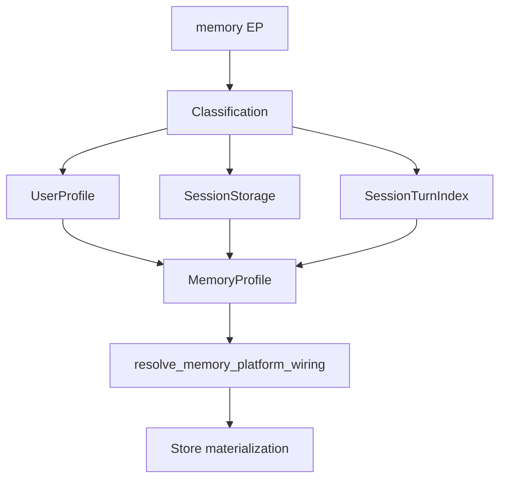

# Memory Store Plugin Author Guide

**Status:** canonical developer guide · **PLATFORM-PLUGIN-DOCS-4**
**Architecture owner:** [`docs/project/architecture/MEMORY.md`](../../architecture/MEMORY.md)
**Platform catalog:** [`EXTENSION_AUTHOR_GUIDE.md`](EXTENSION_AUTHOR_GUIDE.md) · [`PLATFORM_PLUGINS.md`](../../architecture/PLATFORM_PLUGINS.md)

This guide documents **six public memory store plugin factory surfaces** (five tenant-scoped store kinds plus session turn index). There is no single `MemoryPlugin` protocol - do not collapse factory contracts or creation-context types.

---

## Developer journey (D1–D16)

| D | Topic | Status | Section |
|---|-------|--------|---------|
| D1 | Purpose | COMPLETE | §1 |
| D2 | Public contract | COMPLETE | §2 |
| D3 | Minimal implementation | COMPLETE | §3 |
| D4 | External package | COMPLETE | §4 |
| D5 | Local / host path | COMPLETE | §5 |
| D6 | Configuration | COMPLETE | §6 |
| D7 | Secrets / credentials | COMPLETE | §7 |
| D8 | DI / composition | COMPLETE | §8 |
| D9 | Registration / discovery | COMPLETE | §9 |
| D10 | Qualification | COMPLETE | §10 |
| D11 | Runtime use | COMPLETE | §11 |
| D12 | Lifecycle / cleanup | COMPLETE | §12 |
| D13 | Failure behavior | COMPLETE | §13 |
| D14 | Testing | COMPLETE | §14 |
| D15 | Production checklist | COMPLETE | §15 |
| D16 | Troubleshooting | COMPLETE | §16 |

**Overall:** **COMPLETE** - all three surfaces have shipped Tier-3 resolution paths. User-profile and session-storage materialize via `MemoryProfile` plugin selection + typed resolver; session turn index via shared classifier. Bootstrap counting alone does not activate stores (§9).

---

## 1. Purpose - what is pluggable

Memory plugins swap **store backends** behind Tier-1 facades (`SessionManager`, `UserProfileManager`). They are not Context plugins, RAG components, or Integration manifests.

| Surface | Protocol | Factory method | Replaces |
|---------|----------|----------------|----------|
| User profile store | `UserProfileStorePlugin` | `create_user_profile_store(context: UserProfileStoreCreationContext)` | `InMemoryUserProfileStore`, SQLite/Mongo bundles |
| Session storage | `SessionStoragePlugin` | `create_session_storage(context: SessionStorageCreationContext)` | `InMemorySessionStorage`, SQLite bundle |
| Entity temporal memory | `EntityTemporalMemoryStorePlugin` | `create_entity_temporal_memory_store(context: EntityTemporalMemoryStoreCreationContext)` | `InMemoryEntityTemporalMemoryStore` (reference) |
| Procedural memory | `ProceduralMemoryStorePlugin` | `create_procedural_memory_store(context: ProceduralMemoryStoreCreationContext)` | `InMemoryProceduralMemoryStore` (reference) |
| Long-horizon memory | `LongHorizonMemoryStorePlugin` | `create_long_horizon_memory_store(context: LongHorizonMemoryStoreCreationContext)` | `InMemoryLongHorizonMemoryStore` (reference) |
| Session turn vector index | `SessionTurnIndexStorePlugin` | `create_session_turn_index(context: SessionTurnIndexStoreCreationContext)` | `VectorSessionTurnIndexStore` over host vector ports |

All Memory store plugin factory surfaces share one entry-point group; dispatch is by factory method shape:

```text
intergrax.memory_stores
```

**Vector memory:** LTM and episodic indexes reuse the host **integration vector store** (`EmbeddingManager`, `VectorstoreManager`). Plugins supply index adapters - not vendor SDK clients owned by the plugin package.

**Shared truths:**

- `installed` ≠ `discovered` ≠ `enabled` ≠ `production-qualified`
- Trusted in-process Python
- Qualification is host-owned semantic approval
- Secrets stay in host configuration, not EP metadata
- No universal Platform Plugin lifecycle/unload manager

---

## 2. Public contracts

Import from `intergrax.memory.contracts` (plugin protocols) and `intergrax.memory.contracts.memory_store_creation_context` (tenant-scoped creation contexts).

### Typed creation context (tenant-scoped stores)

`UserProfileStoreCreationContext`, `SessionStorageCreationContext`, `EntityTemporalMemoryStoreCreationContext`, `ProceduralMemoryStoreCreationContext`, and `LongHorizonMemoryStoreCreationContext` are **semantic type aliases** of one frozen value object:

```python
# intergrax/memory/contracts/memory_store_creation_context.py
@dataclass(frozen=True, slots=True)
class TenantScopedMemoryStoreCreationContext:
    tenant_id: str | None
```

Each public plugin surface uses a **semantically named** creation-context type in its factory signature even though the underlying fields are shared today.

Host materialization resolves platform configuration into `MemoryStoreMaterializationContext` (internal resolver DTO: `tenant_id`, `integration_profile`, …). The resolver projects that into `TenantScopedMemoryStoreCreationContext` for plugin factories. Plugins do **not** receive the full `IntegrationProfile` or an open `**kwargs` bag at the public factory boundary.

### UserProfileStorePlugin

```python
# intergrax/memory/contracts/memory_store_plugin.py
@runtime_checkable
class UserProfileStorePlugin(Protocol):
    @classmethod
    def plugin_id(cls) -> str: ...

    @classmethod
    def create_user_profile_store(
        cls,
        context: UserProfileStoreCreationContext,
    ) -> UserProfileStore: ...
```

### SessionStoragePlugin

```python
@runtime_checkable
class SessionStoragePlugin(Protocol):
    @classmethod
    def plugin_id(cls) -> str: ...

    @classmethod
    def create_session_storage(
        cls,
        context: SessionStorageCreationContext,
    ) -> SessionStorage: ...
```

### EntityTemporalMemoryStorePlugin · ProceduralMemoryStorePlugin · LongHorizonMemoryStorePlugin

```python
@runtime_checkable
class EntityTemporalMemoryStorePlugin(Protocol):
    @classmethod
    def plugin_id(cls) -> str: ...

    @classmethod
    def create_entity_temporal_memory_store(
        cls,
        context: EntityTemporalMemoryStoreCreationContext,
    ) -> EntityTemporalMemoryStore: ...

# ProceduralMemoryStorePlugin.create_procedural_memory_store(context: ProceduralMemoryStoreCreationContext)
# LongHorizonMemoryStorePlugin.create_long_horizon_memory_store(context: LongHorizonMemoryStoreCreationContext)
```

### SessionTurnIndexStorePlugin

```python
# intergrax/memory/contracts/session_turn_index.py
@dataclass(frozen=True, slots=True)
class SessionTurnIndexStoreCreationContext:
    tenant_id: str
    index_roles: tuple[str, ...] = ("user", "assistant")
    vector_index_namespace: str | None = None
    workspace_id: str | None = None
    embedding_manager: SessionTurnIndexEmbeddingPort | None = None
    vectorstore_manager: SessionTurnIndexVectorstorePort | None = None

@runtime_checkable
class SessionTurnIndexStore(Protocol):
    async def upsert_turn(...) -> None: ...
    async def tombstone_turn(self, entry_id: str) -> None: ...
    async def search_turns(...) -> list[SessionTurnIndexHit]: ...

@runtime_checkable
class SessionTurnIndexStorePlugin(Protocol):
    @classmethod
    def plugin_id(cls) -> str: ...

    @classmethod
    def create_session_turn_index(
        cls,
        context: SessionTurnIndexStoreCreationContext,
    ) -> SessionTurnIndexStore: ...
```

`SessionTurnIndexStore` is an index **over** `SessionStorage`, not a replacement for session persistence. Search hits are typed `SessionTurnIndexHit` (not `list[dict[str, Any]]`).

There is **no** `register_memory_store_plugin()` helper.

---

## 3. Minimal implementation

### User profile store (test fixture pattern)

Reference: `tests/fixtures/plugin_packages/memory_store_plugin/memory_store_plugin/plugin.py` (**test fixture - packaging reference, not production sample**)

```python
from intergrax.memory.contracts.memory_store_creation_context import (
    UserProfileStoreCreationContext,
)
from intergrax.memory.stores.in_memory_user_profile_store import InMemoryUserProfileStore
from intergrax.memory.user_profile_store import UserProfileStore


class ExternalInMemoryUserProfileStorePlugin:
    @classmethod
    def plugin_id(cls) -> str:
        return "external.in_memory_user_profile"

    @classmethod
    def create_user_profile_store(
        cls,
        context: UserProfileStoreCreationContext,
    ) -> UserProfileStore:
        _ = context.tenant_id
        return InMemoryUserProfileStore()
```

### Session turn index (wired surface)

Reference: `tests/fixtures/plugin_packages/session_turn_index_plugin/session_turn_index_plugin/plugin.py` (**test fixture**)

```python
from intergrax.memory.contracts.session_turn_index import SessionTurnIndexStoreCreationContext
from intergrax.memory.session_turn_index_service import VectorSessionTurnIndexStore


class ExternalSessionTurnIndexStorePlugin:
    @classmethod
    def plugin_id(cls) -> str:
        return "external.session_turn_index"

    @classmethod
    def create_session_turn_index(
        cls,
        context: SessionTurnIndexStoreCreationContext,
    ) -> VectorSessionTurnIndexStore:
        if context.embedding_manager is None or context.vectorstore_manager is None:
            raise ValueError("embedding_manager and vectorstore_manager are required")
        return VectorSessionTurnIndexStore(
            embedding_port=context.embedding_manager,
            vectorstore_port=context.vectorstore_manager,
            index_roles=context.index_roles,
            tenant_id=context.tenant_id,
            vector_index_namespace=context.vector_index_namespace,
            workspace_id=context.workspace_id,
        )
```

Host wiring builds `SessionTurnIndexStoreCreationContext` (tenant scope, vector ports, index roles, namespace) before calling the plugin factory.

---

## 4. External package

```toml
[build-system]
requires = ["hatchling"]
build-backend = "hatchling.build"

[project]
name = "my-intergrax-memory-stores"
version = "0.1.0"
requires-python = ">=3.12,<3.13"
dependencies = ["Intergrax-ai==0.1.0"]

[tool.hatch.build.targets.wheel]
packages = ["src/my_intergrax_memory_stores"]

[project.entry-points."intergrax.memory_stores"]
acme_user_profile = "my_intergrax_memory_stores.user_profile:ExternalInMemoryUserProfileStorePlugin"
acme_session_turn = "my_intergrax_memory_stores.session_turn:ExternalSessionTurnIndexStorePlugin"
```

One package may expose multiple EP targets. Dispatch at bootstrap counts plugins by which factory method exists (`create_user_profile_store`, `create_session_storage`, specialized `create_*_memory_store`, or `create_session_turn_index`).

Discovery is **opt-in** (`discover_entry_points=True` or `INTERGRAX_DISCOVER_PLUGINS=true`).

---

## 5. Local / host path

| Surface | Local path | Status |
|---------|------------|--------|
| Session turn index | Pass `session_turn_index_plugins=[MyPlugin]` to `build_session_turn_index_store(...)` | **Supported** |
| User profile store | `MemoryProfile.user_profile_store_plugin_id` + EP discovery, or explicit `MemoryPlatformWiring(user_profile_store=...)` | **Supported** |
| Session storage | `MemoryProfile.session_storage_plugin_id` + EP discovery, or explicit `MemoryPlatformWiring(session_storage=...)` | **Supported** |

EP and explicit/local delivery use the same typed resolver (`intergrax/memory/resolver/`). Explicit `MemoryPlatformWiring` overrides profile selection.

There is **no** `register_memory_store_plugin()` and **no** scaffold CLI.

---

## 6. Configuration - MemoryProfile

`MemoryProfile` on `ApplicationEnvironmentProfile` toggles memory features:

| Field | Role |
|-------|------|
| `enable_user_memory` / `enable_long_term_memory` | User profile manager + optional LTM vector index |
| `enable_org_memory` | Organization profile store |
| `enable_task_memory` | Task KV (not a memory-store plugin surface) |
| `enable_session_vector_index` | Episodic turn index (`SessionTurnIndexStore`) |
| `session_index_top_k`, `session_index_score_threshold` | Episodic search defaults |
| `vector_index_namespace` | Collection namespace for vector indexes |
| `session_index_roles` | Roles indexed for episodic search |
| `include_cross_session_episodic` | Cross-session episodic recall |
| `user_profile_store_plugin_id` | Select external `UserProfileStorePlugin` by `plugin_id` (EP or explicit candidates) |
| `session_storage_plugin_id` | Select external `SessionStoragePlugin` by `plugin_id` |
| `retention_days`, `scope_boundary`, `consolidation_mode` | Policy fields |

Vector memory flags require a resolvable RAG stack with vector backends (`assert_memory_vector_backend_available`).

---

## 7. Secrets and credentials

Memory plugins should consume **host-resolved dependencies** via typed creation contexts (tenant-scoped fields today) or constructor arguments on the returned store. Do not encourage arbitrary `os.environ` lookup in plugin factories unless your domain contract explicitly documents that pattern.

Integration credentials belong in `IntegrationProfile` and provider bundles - the host resolver uses them when materializing baseline stores. External plugins receive bounded creation contexts at the public factory boundary, not the full integration profile.

---

## 8. DI and composition

| Dependency | Who provides |
|------------|--------------|
| `UserProfileStore` / `SessionStorage` instances | Host wiring or custom `MemoryPlatformWiring` |
| `embedding_manager`, `vectorstore_manager` (session turn index ports) | Host RAG stack (`RagStack`) packaged into `SessionTurnIndexStoreCreationContext` |
| `tenant_id` | `TenantScopedMemoryStoreCreationContext.tenant_id` or `SessionTurnIndexStoreCreationContext.tenant_id` from host materialization |
| `rag_stack` | `resolve_rag_stack_for_memory_wiring` / `create_default_rag_stack` |

Plugins return store instances; managers (`UserProfileManager`, `SessionManager`) remain Tier-1.

---

## 9. Registration and discovery (critical)

Memory store plugins follow classified discovery and profile-driven materialization (D8):



*Interpretation:* one EP group, three factory shapes; host profile ids select which plugin materializes each store kind.

```text
plugin contract (Protocol + plugin_id)
    ↓
entry point (`intergrax.memory_stores`) or explicit plugin class
    ↓
classified discovery (`discover_classified_memory_store_plugins`)
    ↓
host profile / wiring (`MemoryProfile` plugin ids, `resolve_memory_platform_wiring`)
    ↓
materialization / activation (`materialize_user_profile_store`, `materialize_session_storage`, `build_session_turn_index_store`)
```

### Discovery semantics

- Entry points under `intergrax.memory_stores` are scanned when host wiring enables `discover_entry_points=True`
- Each loaded class is classified via typed `MemoryStorePluginKind` (Protocol conformance)
- `discover_classified_memory_store_plugins()` returns `MemoryStorePluginDiscoveryResult` with canonical `DomainPluginLoadReport` EP evidence (`accepted`, `rejected`, `failed`, `registered_count`)
- Isolated EP import/factory failures are recorded in `failed`; unsupported loaded targets in `rejected`
- Explicit/local candidates use the same classifier/resolver path with empty EP evidence rows (no fabricated accepted EP metadata)

### What discovery alone does NOT do

- Does **not** create a universal registered catalog of active stores
- Does **not** select which plugin backs a running host
- Does **not** materialize stores - resolver materialization is separate (`resolve_memory_platform_wiring`)

**Discovery alone does not activate a memory provider.** Use `MemoryProfile` plugin selection or explicit `MemoryPlatformWiring` for materialization.

---

## 10. Qualification

Platform qualification primitives exist (`check_platform_compatibility`, production gates). Memory-specific production qualification is host-owned. Compatible EP metadata ≠ production-qualified.

External memory plugins do not receive automatic live-backend qualification for vector indexes - that evidence is separate (RAG/integration qualification).

---

## 11. Runtime use

### Session turn index (wired path)

```text
MemoryProfile.enable_session_vector_index=True
  → resolve_rag_stack_for_memory_wiring(env, tenant_id=…)
  → build_session_turn_index_store(env, tenant_id=…, rag_stack=…)
      → discover_session_turn_index_plugin_types()  # EP scan
      → plugin.create_session_turn_index(SessionTurnIndexStoreCreationContext)  # first match
      → else VectorSessionTurnIndexStore (default)
  → SessionManager(session_turn_index_store=…)
```

Explicit local override:

```python
from intergrax.applications._shared.memory_vector_wiring import build_session_turn_index_store

index = build_session_turn_index_store(
    env,
    tenant_id="tenant-a",
    rag_stack=rag_stack,
    session_turn_index_plugins=[ExternalSessionTurnIndexStorePlugin],
)
```

### User profile + session storage (shipped path)

```text
MemoryProfile.user_profile_store_plugin_id / session_storage_plugin_id (optional)
  → resolve_memory_platform_wiring(env, discover_entry_points=…, explicit_memory_plugins=…)
      → discover_classified_memory_store_plugins (EP discovery)
        OR explicit_memory_plugins candidates (local delivery)
      → materialize_user_profile_store(plugin_id, ctx, catalog=…)
        / materialize_session_storage(plugin_id, ctx, catalog=…)
      → MemoryStoreMaterializationContext (internal: tenant_id, integration_profile, …)
      → TenantScopedMemoryStoreCreationContext passed to plugin factories
  → IntegrationProfile baseline (SQLite / MongoDB / in-memory) for unselected slots (host resolver — not passed to plugin factories)
  → MemoryPlatformWiring(session_storage, user_profile_store, memory_store_plugin_load_report, …)
  → build_session_manager_from_environment(env, memory_wiring=wiring, tenant_id=…, rag_stack=…)
```

Selection is explicit via `MemoryProfile` plugin ids - registering explicit candidates alone does not choose the store.

Explicit local override (same resolver; EP discovery or explicit candidates):

```python
from intergrax.applications._shared.memory_wiring import resolve_memory_platform_wiring

# MemoryProfile must select plugin ids matching explicit candidates.
wiring = resolve_memory_platform_wiring(
    env,
    discover_entry_points=False,
    explicit_memory_plugins=(
        MyUserProfilePlugin,
        MySessionStoragePlugin,
    ),
)
# env.memory_profile.user_profile_store_plugin_id = MyUserProfilePlugin.plugin_id
# env.memory_profile.session_storage_plugin_id = MySessionStoragePlugin.plugin_id
```

Configuration failures (unknown plugin id, wrong kind, duplicate id, materialization error, invalid factory return) are **fail-closed** (`MemoryStorePluginResolutionError`).

**Historical baseline (ENTERPRISE-1):** user/session EPs were counted only; no Tier-3 resolver. Closed by ENTERPRISE-5.

**Historical baseline (pre MEM-HARDEN-FINAL-1):** public store factories accepted `**kwargs`. **Current contract:** typed creation contexts only (MEM-HARDEN-FINAL-1).

### Observability and execution correlation

Memory emits vendor-neutral `MemoryDiagnosticEvent` records via `MemoryDiagnosticEmitter` into a pluggable `MemoryObservabilitySink` (not OpenTelemetry/Datadog-specific).

Canonical platform execution identity (`TaskId`, `RunId`, `AttemptId`, `ExecutionId` from `intergrax.contracts.execution_identity`) may be **projected** onto diagnostic events when Memory runs inside an execution flow. Memory **does not mint, own, or mutate** execution identity.

- `MemoryDiagnosticEvent.event_id` identifies the diagnostic event (distinct from `execution_id`).
- Standalone Memory (outside execution flow): `task_id`, `run_id`, `attempt_id`, and `execution_id` remain `None` — no synthetic identifiers.
- **Memory W3C trace propagation:** **NOT INTEGRATED** (`traceparent` is not part of the Memory diagnostic contract). Platform/runtime tracing may carry W3C headers separately; that boundary is intentional.

Sink failure does not change Memory business outcomes (`OBSERVABILITY = NOT AUTHORITY`).

---

## 12. Lifecycle and cleanup

- **Store lifetime:** factories return instances owned by the host wiring (`SessionManager`, `UserProfileManager`)
- **Vector clients:** when using `VectorSessionTurnIndexStore`, embedding/vector managers follow RAG stack lifecycle
- **No universal unload:** process-global EP import side effects only; no Platform Plugin shutdown API

If a factory returns a persistent client pool, the host owns closing it on application shutdown.

---

## 13. Failure behavior

| Failure | Result |
|---------|--------|
| EP not discovered | Baseline integration wiring used when no `plugin_id` selected |
| Expecting discovery alone to activate stores | Stores not active until profile `plugin_id` or explicit wiring selects and materializes a plugin |
| Unknown / wrong-kind `plugin_id` | `MemoryStorePluginResolutionError` (fail-closed) |
| Duplicate plugin id in resolver | `MemoryStorePluginResolutionError` |
| Materialization failure | `MemoryStorePluginResolutionError` |
| `enable_session_vector_index` without tenant | `MemoryVectorBackendUnavailableError(reason="tenant_required")` |
| Vector flags without RAG stack | `MemoryVectorBackendUnavailableError(reason="vector_backend_unavailable")` |
| Wrong factory return type | `MemoryStorePluginResolutionError` (invalid `UserProfileStore` / `SessionStorage`) |
| Multiple turn-index EPs | First discovered plugin wins in `build_session_turn_index_store` |

---

## 14. Testing

| Test | Path |
|------|------|
| Classified discovery / resolver | `tests/unit/memory/test_memory_store_resolver.py` |
| Vector episodic wiring | `tests/integration/applications/test_memory_vector_ltm_wiring.py` |
| Memory platform wiring | `tests/unit/applications/test_memory_wiring.py` |

Author pattern for explicit plugin wiring:

```python
from intergrax.applications._shared.memory_wiring import resolve_memory_platform_wiring

wiring = resolve_memory_platform_wiring(
    env,
    discover_entry_points=False,
    explicit_memory_plugins=(MyUserProfilePlugin,),
)
# env.memory_profile.user_profile_store_plugin_id = MyUserProfilePlugin.plugin_id
```

---

## 15. Production checklist

- [ ] Correct protocol for your surface (do not mix factory method names)
- [ ] Stable `plugin_id` per class
- [ ] For episodic index: read `SessionTurnIndexStoreCreationContext` (`embedding_manager`, `vectorstore_manager`, `tenant_id`, …)
- [ ] Do not assume entry-point discovery alone activates your store - use profile `plugin_id` or explicit wiring
- [ ] For user/session stores: set `user_profile_store_plugin_id` / `session_storage_plugin_id` or pass explicit plugin candidates
- [ ] Tombstone semantics for vector indexes when primary store deletes entries
- [ ] Tenant isolation enforced in store implementation
- [ ] No secrets in plugin metadata

---

## 16. Troubleshooting

| Symptom | Check |
|---------|-------|
| EP installed but store unchanged | No `plugin_id` on `MemoryProfile`; discovery disabled; check `INTERGRAX_DISCOVER_PLUGINS` |
| Selected plugin fails to load | Inspect `MemoryPlatformWiring.memory_store_plugin_load_report.failed`; selected id fails closed with precise error |
| Unsupported EP target | Appears in `memory_store_plugin_load_report.rejected`; materialized stores validated via canonical `UserProfileStore` / `SessionStorage` |
| Discovery finds plugin but no effect | Discovery does not select or materialize - configure profile `plugin_id` or explicit wiring (§9) |
| Episodic index always default | No turn-index EP discovered; pass `session_turn_index_plugins=` explicitly |
| `tenant_required` | Pass non-empty `tenant_id` to session manager wiring |
| `vector_backend_unavailable` | Enable integration vector store; resolve `rag_stack` before memory wiring |
| Wrong store type at runtime | Inspect `resolve_memory_platform_wiring` path (SQLite/Mongo/in-memory) |

---

**Next:** [`EXTENSION_AUTHOR_GUIDE.md`](EXTENSION_AUTHOR_GUIDE.md) · [`MEMORY.md`](../../architecture/MEMORY.md) §5.3
