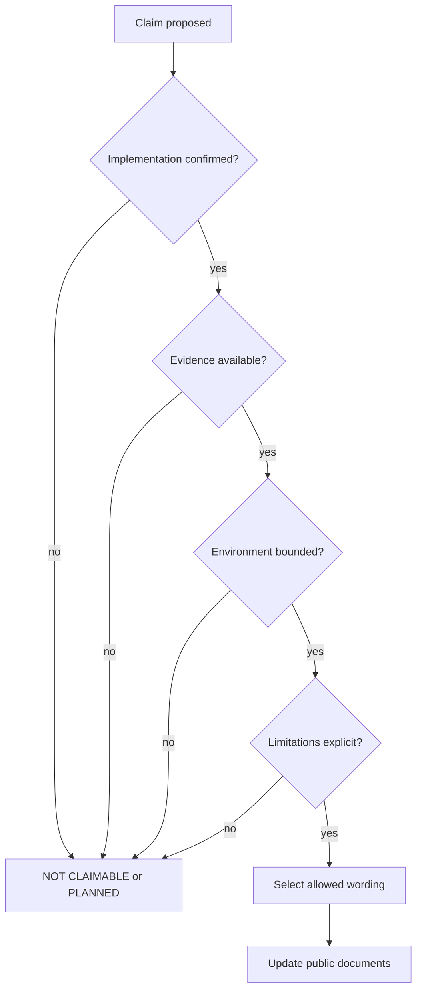

<!--
© Artur Czarnecki. All rights reserved.
Intergrax is source-available under the Intergrax Evaluation and Collaboration License 1.0.
See LICENSE for permitted evaluation, collaboration, and contribution use.
-->

# Intergrax Public Proof and Claims Model

Canonical maintainer-facing contract for public proof status, evidence requirements, claim qualification, and proof promotion rules.

**Public dashboard:** [`../../PROOFS.md`](../../PROOFS.md)

This document owns:

- public status vocabulary;
- evidence requirements;
- claim qualification;
- proof promotion rules;
- LKW and Token Optimization public classifications;
- README capability-discovery rules;
- README performance-promotion rules;
- future proof-update workflow.

It does **not** replace:

- implementation plans;
- architecture canon;
- test suites;
- proof evidence artifacts;
- `LICENSE`;
- `COLLABORATION.md`.

---

## 1. Why this model exists

Public documentation must let a first-time visitor distinguish:

```text
implemented mechanism
bounded proof
partial capability
planned capability
unsupported claim
```

Without this separation, readers confuse design agreement, unit-test contracts, bounded live proof, product completeness, and market validation. Public proof information must be **truthful**, **evidence-linked**, **visually clear**, **easy to scan**, and **explicit about limitations**.

---

## 2. Five public statuses

Use exactly these labels. Visual legend may pair symbols (✅ 🧪 🟡 🗓️ ⛔); **text labels are authoritative**.

### IMPLEMENTED

Use only when:

- a concrete mechanism exists;
- relevant bounded tests or accepted implementation evidence exist;
- the claim describes only the implemented mechanism;
- no live, product, or production validation is implied.

### BOUNDED PROOF

Use only when:

- the proof was actually executed;
- the environment, provider, model, operating system, or workload is named;
- evidence is available;
- limitations are stated;
- wording does not generalize beyond the proof scope.

### PARTIAL

Use when:

- some slices are implemented;
- the end-to-end capability or product result is incomplete;
- a required dependency, integration, or validation gate remains open.

### PLANNED

Use when:

- architecture or scheduling exists;
- runtime behavior, proof, or integration is not yet available.

Accepted architecture alone does **not** make a capability implemented.

### NOT CLAIMABLE

Use when:

- no evidence supports the claim;
- wording would generalize beyond bounded evidence;
- product or commercial validation is incomplete;
- the claim is explicitly blocked by current guardrails.

---

## 3. Evidence hierarchy

```text
architecture/design
→ implementation and tests
→ bounded live proof
→ product workflow proof
→ real-user validation
→ commercial validation
```

Each level does **not** automatically imply the next.

| Level | Proves | Does not prove |
|-------|--------|----------------|
| Architecture / design | Design agreement | Runtime behavior |
| Implementation + tests | Bounded contract | Live or product validation |
| Bounded live proof | Named environment behavior | Universal or production behavior |
| Product workflow proof | End-to-end product slice | Commercial readiness |
| Real-user validation | Observed user outcomes | Universal savings or SLA |
| Commercial validation | Market and business proof | Technical mechanism correctness |

**Frozen rule:**

```text
implemented code
≠ live proof
≠ product validation
≠ commercial validation
≠ production readiness
```

An accepted commit or passing unit test proves only its bounded contract. An architecture document proves design agreement, not runtime behavior. A live proof applies only to its named environment and workload.

---

## 4. Claim anatomy

Every positive public claim must include or be traceable to:

| Dimension | Requirement |
|-----------|-------------|
| **Subject** | What component or proof path |
| **Exact capability** | What behavior is claimed |
| **Status** | One of the five canonical labels |
| **Evidence** | Test, proof artifact, or accepted implementation record |
| **Environment or workload** | Named when proof-level |
| **Limitation** | What the claim does not cover |
| **Verification path** | Link or command for independent check |
| **Prohibited generalization** | What readers must not infer |

Every canonical proof row must distinguish:

```text
implementation state
proof state
public status label
evidence
limitation
allowed public wording
```

Do not collapse all maturity into one status.

---

## 5. Proof promotion decision



When sources disagree, apply **claim audit rules** (§11): use the lower supported claim; never infer completion from architecture acceptance.

---

## 6. LKW classification rules

**Frozen classification:**

```text
LKW = Primary product proof
```

| Attribute | Public position |
|-----------|-----------------|
| Product status | Backend Product Alpha / MVP |
| Platform proof | Bounded — Tier-3 application and platform behavior |
| Hybrid Ask | Not complete — **PLANNED** |
| Vendor integration catalog | Not complete — partial slices only |
| Real-user validation | **NOT CLAIMABLE** |
| Commercial validation | **NOT CLAIMABLE** |
| Full live platform proof | **PLANNED** |

LKW is the primary product-development and product-validation program. Current platform proof is **bounded**. It does not prove complete Hybrid Ask, every planned vendor integration, real-user validation, commercial validation, or finished SaaS.

---

## 7. Token Optimization classification rules

**Frozen classification:**

```text
Token Optimization = Featured platform-capability proof
```

| Category | Current public position |
|----------|-------------------------|
| **Implemented mechanisms** | Deterministic pipeline, approved-configuration routing, protected regions, receipts/fallback, cache-stable assembly, exact-send integrity, cache-aware execution gate |
| **Bounded proof** | vLLM prefix-cache proof in named environment |
| **Partial** | Unified Context Lifecycle — CTX-UCL-5 accepted/closed; CTX-UCL-1 through CTX-UCL-6 accepted/closed through 6D; CTX-UCL-CLOSEOUT-1 ready for final review / pending independent acceptance |
| **Planned** | TOKEN-10E; TOKEN-10F; TOKEN-10G; TOKEN-10H |
| **NOT CLAIMABLE** | Universal token reduction, production-proven savings, provider-independent cache behavior, completed in-cache compaction |

Token Optimization demonstrates a reusable platform mechanism. LKW-PF6 product proof remains scheduled after universal platform proof (TOKEN-10G).

---

## 8. README discovery versus performance promotion

Resolves TOKEN-10G / TOKEN-10H conflict for future root README work.

### Allowed before TOKEN-10H

A neutral root README capability mention and main-guide link are allowed when:

- no numeric savings are used;
- no universal performance claim is used;
- current status is qualified;
- bounded-proof language is preserved;
- in-cache compaction is not presented as complete.

### Still gated by TOKEN-10G and TOKEN-10H

The following remain **blocked**:

- performance or savings badges;
- percentage-reduction headlines;
- universal token or cost claims;
- production-proven savings;
- promotion of universal proof results;
- claims that TOKEN-10G hard gates passed;
- claims that TOKEN-10H public proof promotion completed.

Detail: [`TOKEN_OPTIMIZATION_CLAIMS.md`](TOKEN_OPTIMIZATION_CLAIMS.md) § README discovery and promotion boundary.

---

## 9. Public update workflow

Every future proof change must update, in order:

```text
owning implementation plan or proof evidence
→ canonical claims model (this document)
→ PROOFS.md
→ affected feature/product guide
→ future root README when relevant
→ focused claims regression tests
```

Skipping a layer creates public drift.

---

## 10. Source-of-truth boundaries

| Topic | Owner |
|-------|-------|
| Public proof dashboard | `PROOFS.md` |
| Status vocabulary and promotion rules | this document |
| LKW proof execution | `LKW_PLATFORM_PROOF.md` |
| LKW product status | `applications/local_workspace_application/docs/IMPLEMENTATION_PLAN.md` |
| Token Optimization guide | `docs/features/token_optimization/README.md` |
| Token Optimization claim guardrails | `TOKEN_OPTIMIZATION_CLAIMS.md` |
| UCL implementation status | `docs/plan/UNIFIED_CONTEXT_LIFECYCLE.md` |
| TOKEN-10 implementation status | `docs/features/plan/TOKEN_OPTIMIZATION.md` |
| Public reader navigation | `docs/PUBLIC_DOCUMENTATION_MAP.md` |
| Public documentation architecture | `PUBLIC_DOCUMENTATION_ARCHITECTURE.md` |
| Public positioning | `INTERGRAX_PUBLIC_POSITIONING.md` |

---

## 11. Claim audit rules

When sources disagree:

1. The owning current implementation plan determines implementation phase.
2. A proof evidence artifact determines whether bounded proof exists.
3. Public docs must use the **lower** supported claim.
4. Never infer completion from architecture acceptance.
5. Never infer commercial or real-user validation from technical proof.
6. Never infer provider-independent behavior from one provider proof.
7. Never infer production readiness from unit or integration tests.
8. Record any unresolved contradiction in this document.

Do not silently choose the more promotional interpretation.

### Unresolved contradictions

None recorded at task execution time. If plan and public docs diverge during parallel work, update this section before promoting any claim.
