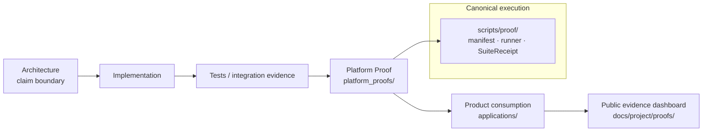

# Intergrax Platform Proofs

**Status:** Canonical gateway  
**Audience:** Maintainers, architects, proof authors

---

## What are Platform Proofs?

A **Platform Proof** is an executable falsification attempt against a bounded claim about a **reusable Intergrax platform mechanism** — not a product workflow demo and not a substitute for unit or integration tests.

Platform proofs live under `platform_proofs/`. They prove that a platform domain or cross-layer platform feature behaves as claimed across realistic boundaries. Products under `applications/` may **consume** platform mechanisms, but product execution is **not** independent proof of those mechanisms.

**Normative rule (non-negotiable):**

> A Product Proof may demonstrate that a product successfully consumes platform mechanisms, but product-specific execution **MUST NOT** substitute for an independently owned Platform Proof of the reusable platform capability.

---

## Folder responsibilities

| Path | Owns |
|------|------|
| [`platform_proofs/`](.) | Reusable **platform mechanism** proofs — methodology, coverage map, proof design artifacts |
| [`scripts/proof/`](../scripts/proof/) | Canonical **execution infrastructure** — manifest, profiles, runner, `SuiteReceipt` |
| [`docs/project/proofs/`](../docs/project/proofs/) | **Public** proof and evidence dashboard — what wording accepted evidence permits |
| [`applications/`](../applications/) | **Products** and their **product proofs** — not platform domains |

**LKW** (`applications/local_workspace_application/`) is a **product**. LKW proofs remain product-owned. They do not qualify platform domains in the [Platform Proof Map](PLATFORM_PROOF_MAP.md).

---

## Canonical documents

| Document | Role |
|----------|------|
| [PLATFORM_PROOF_PROTOCOL.md](PLATFORM_PROOF_PROTOCOL.md) | How platform proofs are designed, classified, executed, and evidenced |
| [PLATFORM_PROOF_MAP.md](PLATFORM_PROOF_MAP.md) | Coverage map for 28 canonical domains + feature proofs |
| [PLATFORM_PROOF_AUTHORING_GUIDE.md](PLATFORM_PROOF_AUTHORING_GUIDE.md) | Practical workflow for independent proof sessions |

**Related (outside this folder):**

- [Public proof dashboard](../docs/project/proofs/PROOFS.md)
- [Public proof and claims model](../docs/project/maintainers/public-adoption/PUBLIC_PROOF_AND_CLAIMS_MODEL.md)
- [Runtime architecture hub](../docs/project/architecture/intergrax_runtime_architecture.md) — canonical domain topology

---

## First designed reference proof

**`TOOLS-ITERATIVE-SQL-INVESTIGATION`** — coverage **DESIGNED** (implementation follows PP-2).

Bounded claim: the iterative tool runtime uses real SQL observations to drive subsequent evidence-dependent tool calls and reaches a bounded conclusion while preserving an explicit investigation chain.

See [Platform Proof Map — TOOLS](PLATFORM_PROOF_MAP.md) and [tools reference placeholder](tools/README.md).

---

## What this is not

- Not a product directory (`applications/`)
- Not a generic test suite (`tests/`)
- Not a public evidence archive (`docs/project/proofs/`)
- Not an alternative proof runner (use `scripts/proof/`)
