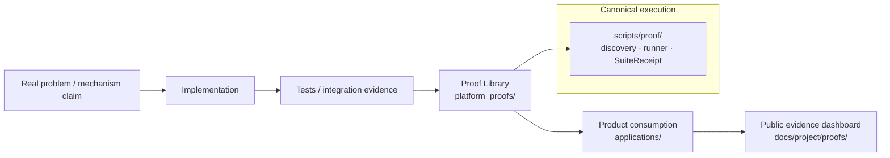

# Intergrax Proof Library

**Status:** Canonical technical gateway  
**Audience:** Maintainers, architects, proof authors

---

## What is the Proof Library?

The **Intergrax Proof Library** (`platform_proofs/`) contains **executable falsification attempts** for bounded **real-world Scenario claims** and reusable platform **Conformance claims** — not product workflow demos and not a substitute for unit or integration tests.

The library has two top-level classes:

| Class | Role | Entry framing |
|-------|------|---------------|
| **SCENARIO** | **Production-capable autonomous application component** that solves a concrete real-world problem — plus adversarial falsification, evidence, evaluation, and report | Problem-first — **primary public class** |
| **CONFORMANCE** | **Mechanism-level executable proof** — CI, regression, contract verification, architecture confidence | Mechanism-first — secondary class |

**SCENARIO in one line:** production-capable application component + adversarial proof layer that falsifies and evidences it (the proof layer does **not** substitute for the application).

**CONFORMANCE in one line:** platform mechanism → controlled harness → contract/invariant → evidence.

Normative detail: [Authoring Guide § Scenario Proof — production-capable application contract](PLATFORM_PROOF_AUTHORING_GUIDE.md#scenario-proof--production-capable-application-contract) · [Authoring Guide § Application Survival Test](PLATFORM_PROOF_AUTHORING_GUIDE.md#application-survival-test) · [Protocol § B Proof Library classes](PLATFORM_PROOF_PROTOCOL.md#b-proof-library-classes) · [Protocol § G Mock/fixture policy](PLATFORM_PROOF_PROTOCOL.md#g-mock--fixture-policy)

Products under `applications/` may **consume** platform mechanisms, but product execution is **not** independent proof of those mechanisms.



**Normative rule (non-negotiable):**

> A Product Proof may demonstrate that a product successfully consumes platform mechanisms, but product-specific execution **MUST NOT** substitute for an independently owned Platform Proof of the reusable platform capability.

---

## SCENARIO vs CONFORMANCE

| | **SCENARIO** | **CONFORMANCE** |
|---|--------------|-----------------|
| **Framing** | Problem-first | Mechanism-first |
| **Claim** | Bounded real-world system claim | Bounded mechanism / invariant claim |
| **Application** | Production-capable application component required | Controlled harness |
| **Domains / mechanisms** | May exercise **multiple** — declared as metadata | Declares mechanism under proof |
| **Public role** | Primary Proof Library presentation | Secondary — CI, regression, contract confidence |
| **Canonical location** | `platform_proofs/scenarios/<scenario_slug>/` | `platform_proofs/<domain>/<proof_slug>/` (existing Conformance packages) |

A proof does **not** belong to one platform domain. It may exercise one or more domains and mechanisms — declared in descriptor metadata (`domains_exercised`, `mechanisms_exercised`), not by top-level taxonomy.

**Scenario application ≠ Product.** A Scenario may have real business workflow and production-capable application core; it still belongs under `platform_proofs/scenarios/`, not `applications/`. Product proofs remain product-owned.

---

## Where things live

| Path | Responsibility |
|------|----------------|
| [`platform_proofs/`](.) | Proof Library — protocol, authoring workflow, proof packages |
| [`platform_proofs/scenarios/<scenario_slug>/`](scenarios/) | **Canonical Scenario packages** — each package is the source of truth for that scenario (`README.md`, `SCENARIO_SPEC.md`, and post-implementation artifacts) |
| [`scripts/proof/`](../scripts/proof/) | **Canonical execution infrastructure** — discovery, profiles, runner, `SuiteReceipt` |
| [`docs/project/proofs/PROOF_LIBRARY.md`](../docs/project/proofs/PROOF_LIBRARY.md) | **Public** Scenario presentation — user-facing catalog (not maintained inside `platform_proofs/`) |
| [`docs/project/proofs/PROOFS.md`](../docs/project/proofs/PROOFS.md) | **Public** evidence and claims dashboard |
| [`applications/`](../applications/) | **Products** and their **product proofs** — not platform proof packages |

**LKW** (`applications/local_workspace_application/`) is a **product**. LKW proofs remain product-owned. They do not qualify as Scenario or Conformance proofs under `platform_proofs/`.

There is **no** manual scenario registry in `platform_proofs/`. Scenario existence is determined by filesystem packages; execution status by `proof.json` / discovery; public claims by `docs/project/proofs/`.

---

## Canonical documents

| Document | Role |
|----------|------|
| [PLATFORM_PROOF_PROTOCOL.md](PLATFORM_PROOF_PROTOCOL.md) | Normative architecture — classification, claim semantics, falsification, evidence |
| [PLATFORM_PROOF_AUTHORING_GUIDE.md](PLATFORM_PROOF_AUTHORING_GUIDE.md) | Practical workflow for independent Scenario and Conformance proof sessions |
| [README.md](README.md) | This gateway |

**Related (outside this folder):**

- [Public Scenario catalog](../docs/project/proofs/PROOF_LIBRARY.md)
- [Public proof dashboard](../docs/project/proofs/PROOFS.md)
- [Public proof and claims model](../docs/project/maintainers/public-adoption/PUBLIC_PROOF_AND_CLAIMS_MODEL.md)
- [Runtime architecture hub](../docs/project/architecture/intergrax_runtime_architecture.md) — canonical domain topology (metadata reference, not proof taxonomy)

---

## Create a new Scenario package

Design-stage Scenario packages are created **only** via the canonical scaffold:

```bash
uv run python scripts/proof/create_scenario_proof.py --slug <slug> --title "<title>"
```

This creates `platform_proofs/scenarios/<slug>/` with `README.md` and `SCENARIO_SPEC.md`. See [PLATFORM_PROOF_AUTHORING_GUIDE.md](PLATFORM_PROOF_AUTHORING_GUIDE.md) for the Scenario Quality Gate before implementation.

The first in-development scenario: [`scenarios/ai_incident_investigation/README.md`](scenarios/ai_incident_investigation/README.md).

---

## What this is not

- Not a product directory (`applications/`)
- Not a generic test suite (`tests/`)
- Not a public evidence archive (`docs/project/proofs/`)
- Not a manual domain-coverage registry
- Not an alternative proof runner (use `scripts/proof/`)
