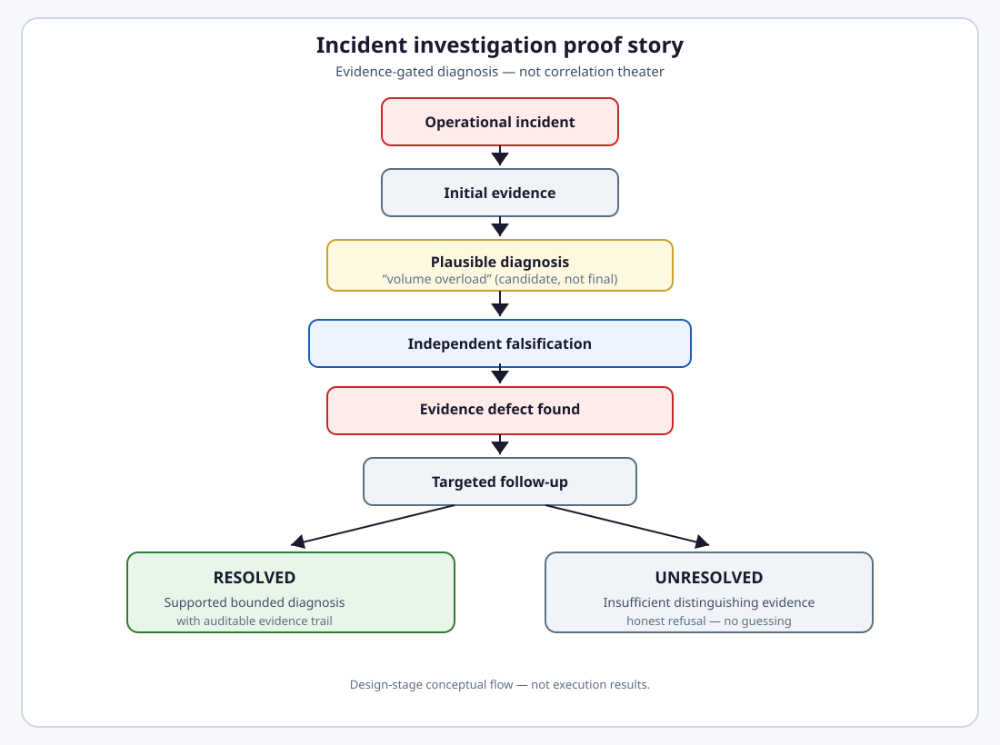

# AI Incident Investigation with Independent Verification

> **Can an AI investigate an operational incident without turning correlation into a confident false diagnosis?**

A fictional industrial manufacturer needs a defensible root-cause diagnosis when production target attainment collapses — not a fluent story that sounds right under time pressure.

> [!NOTE]
> **Scenario status:** SCENARIO DESIGN ACCEPTED — platform-native skeleton implemented; full scenario dataset, executable public proof, and accepted evidence/report not established yet.

> **Synthetic scenario provenance:** This is a fully fictional operational scenario. The organization, facility, incident, datasets, telemetry, staffing records, equipment behavior, and numerical values are synthetic and are not derived from any employer, customer, production environment, confidential source, or proprietary system.

## Abstract

At a fictional industrial manufacturing plant, production target attainment on a key assembly line falls sharply during a defined operating window while cycle-time degradation concentrates on heavier, more complex product assemblies. The first operational picture points to workload overload: production order volume is up, throughput performance drops in the same period, and the affected line stands out. Acting on that story before an upcoming high-volume production window would mean overtime, line reallocation, and staffing moves — all costly if the diagnosis is wrong. The opening evidence is intentionally misleading; correlation looks like causation. This scenario asks whether an AI investigation system can challenge that first explanation, gather the evidence needed to distinguish competing causes, and either deliver a bounded defensible diagnosis or honestly refuse with UNRESOLVED when certainty is not justified.

## At a glance

| Field | Value |
| --- | --- |
| **Problem** | Production target attainment degradation during a defined operating window |
| **Observed impact** | Target attainment ~94% → ~78%; cycle-time degradation on complex assemblies |
| **Trap** | Workload rises while throughput declines — correlation presented as causation |
| **Decision risk** | Wrong overtime, line reallocation, or capacity action before high-volume production window |
| **Scenario outcome** | RESOLVED or UNRESOLVED |
| **Status** | ACCEPTED FOR IMPLEMENTATION |
| **Proof class** | SCENARIO |
| **Slug** | `ai_incident_investigation` |

## Visual proof story

<a href="assets/proof-story-light.svg">
<picture>
  <source media="(prefers-color-scheme: dark)" srcset="assets/proof-story-dark.svg">
  <source media="(prefers-color-scheme: light)" srcset="assets/proof-story-light.svg">
  
</picture>
</a>

[View full-size diagram](assets/proof-story-light.svg)

## The problem

At Plant A, production target attainment on **Line 4** drops from roughly **94% to 78%** during a Tuesday–Thursday window while cycle-time degradation concentrates on heavier, more complex product assemblies. Operations leadership needs a **defensible root-cause diagnosis** from fragmented telemetry, staffing, equipment, and production workload records — the same sources a human incident lead would query.

## The risk

Wrong conclusions trigger real operational harm: overtime on the wrong line, bad work rescheduling, missed equipment repair, and failure during the upcoming high-volume production window. Target attainment misses affect committed production schedules, customer trust, and readiness for the next production run.

## The naive failure / trap

Initial facts look like overload: production workload up ~22%, throughput performance down, Line 4 disproportionately affected. A naive investigator concludes **production line overload** and recommends capacity responses. That story is plausible, leadership-aligned, and **wrong** given full admissible evidence.

<a href="assets/correlation-trap-light.svg">
<picture>
  <source media="(prefers-color-scheme: dark)" srcset="assets/correlation-trap-dark.svg">
  <source media="(prefers-color-scheme: light)" srcset="assets/correlation-trap-light.svg">
  
</picture>
</a>

[View full-size diagram](assets/correlation-trap-light.svg)

## Adversarial challenge

The scenario embeds credible adversarial conditions: a workload–throughput correlation trap, conflicting staffing sources, stale records, missing decisive telemetry, and competing hypotheses that must be distinguished. A skeptical engineer should be able to ask whether a simple investigator-plus-critic graph is sufficient — and the design should show why not.

Full adversarial conditions, skeptic challenge, and quality gate rationale: [Scenario Specification § A](SCENARIO_SPEC.md#a-scenario).

## What the proof claims

> **No material incident diagnosis is accepted unless its material claims are supported by auditable evidence and survive an independent falsification attempt.**

Correlation-only narratives do not qualify. The system must surface evidence defects, gather targeted follow-up when needed, and either emit a **bounded RESOLVED** diagnosis or an honest **UNRESOLVED** refusal.

Normative claim, guarantees, and excluded claims: [Scenario Specification § B](SCENARIO_SPEC.md#b-solution).

## PASS / FAIL (summary)

| PASS | FAIL |
| --- | --- |
| Concrete evidence defect identified | Generic disagreement |
| Conflict surfaced | Source silently discarded |
| Stale evidence rejected or qualified | Stale treated as current |
| Missing evidence requested or UNRESOLVED | Evidence invented |
| Supported RESOLVED or honest UNRESOLVED | Confident unsupported root cause |

Full normative PASS/FAIL contract: [Scenario Specification § B](SCENARIO_SPEC.md#pass).

## Outcomes

| Outcome | Meaning |
| --- | --- |
| **RESOLVED** | Best-supported bounded operational root-cause diagnosis with auditable evidence trail; competing hypotheses weakened |
| **UNRESOLVED** | Critical distinguishing evidence unavailable or hypotheses indistinguishable — no confident guessing |

## Latest verified run

> [!NOTE]
> **Not yet available.** This scenario is accepted for implementation; no executable proof run has been performed. After implementation this section will show verdict, proof version, Intergrax SHA, model/provider, run timestamp, RESOLVED/UNRESOLVED outcome, and key invariant results.

## Run / report / evidence / source

> [!NOTE]
> **Not yet available.** No report, evidence bundle, or reproduction path exists at design stage. Links appear here only after real execution and report acceptance.

## Limitations

Single bounded manufacturing incident fixture with designed adversarial conditions — not arbitrary enterprise data. Design stage only: no runtime, evidence, or report exists yet. Evaluator semantics are scoped to this scenario's claim.

Full limitations and excluded claims: [Scenario Specification § B](SCENARIO_SPEC.md#limitations).

## Go deeper

**[Read the full Scenario Specification](SCENARIO_SPEC.md)** — deep contract for scenario design, solution semantics, Intergrax fit, gap decision, and proof build (A/B/C/D/E).
