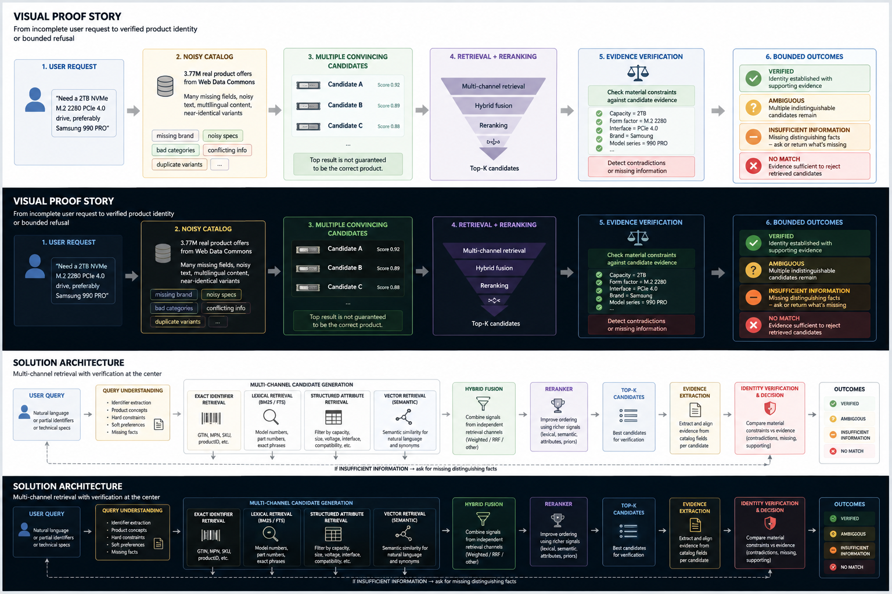
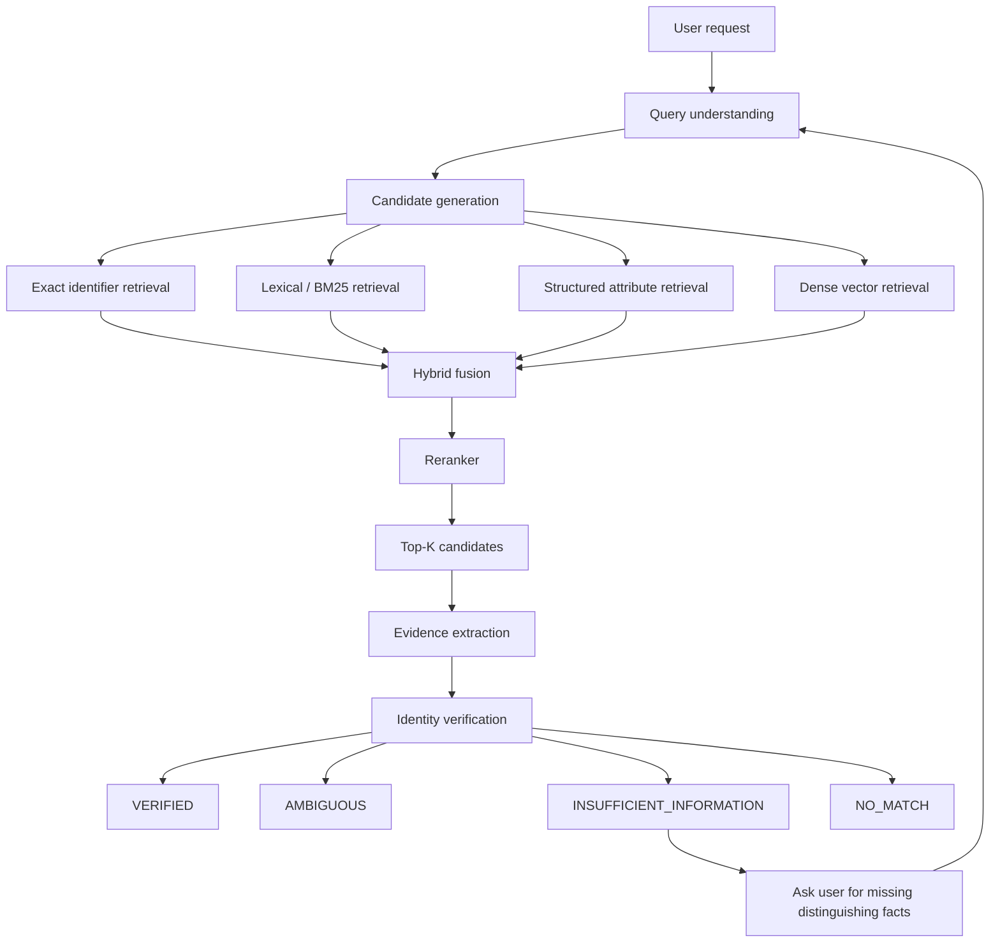

# Verified Product Identification at Catalog Scale

> **Can a system establish verified product identity from incomplete natural-language requests against millions of noisy catalog offers — without mistaking the top search result for a verified match?**

A large industrial distributor maintains a catalog of millions of product offers sourced from heterogeneous retailers. A technician, buyer, or support agent describes a part imperfectly — by model fragment, compatibility requirement, partial identifier, or natural language. Several candidates look almost identical. Selecting the wrong variant ships an incompatible component, triggers a return, or causes downtime. This scenario tests whether a system can **retrieve plausible candidates, verify material identity constraints from catalog evidence, and refuse when certainty is not justified** — not merely return something semantically similar.

> [!NOTE]
> **Scenario status:** DESIGN / NOT YET ACCEPTED — design ready for quality gate; real 3.77M-offer dataset foundation validated; solution architecture documented; implementation not initialized; no executable proof, evidence, or report exists yet.

## Abstract

Enterprise parts and product catalogs contain millions of noisy, heterogeneous offers: missing brands, conflicting attributes, retailer-local SKUs, near-identical variants, and multilingual descriptions. Users rarely provide perfect identifiers. They describe what they need in natural language, partial model numbers, or compatibility constraints.

The naive answer — embed the catalog, retrieve top-k, let an LLM pick the best match — optimizes for **similarity**, not **identity**. Top-ranked retrieval can confidently select a near-identical variant with incompatible voltage, interface, or capacity. Wrong identification has real operational cost: wrong replacement parts, RMAs, procurement errors, and service delays.

This scenario asks whether a system can combine independent retrieval channels (exact identifiers, lexical search, structured attributes, dense vectors), rerank for recall-quality ordering, and then **verify** material identity constraints against traceable catalog evidence. When evidence is contradictory, ambiguous, or insufficient, the system must return a bounded non-verified outcome instead of presenting the highest-ranked candidate as fact.

The WOW moment is simple and uncomfortable: **top search result ≠ verified product**.

## At a glance

| Field | Value |
| --- | --- |
| **Problem** | Verify product identity from incomplete, imprecise user descriptions against a noisy multi-million-offer catalog |
| **Dataset** | Web Data Commons Large Scale Product Corpus V2 — canonical selected subset |
| **Scale** | 3,770,377 real product offers; 2,753,163 cluster references; 24.6M structured attribute entries |
| **Observed difficulty** | Missing fields, multilingual noise, near-identical variants, conflicting KVP/spec tables, identifier collisions |
| **Trap** | Semantic similarity and top-1 retrieval treated as verified product identity |
| **Decision risk** | Wrong variant procured, incompatible replacement installed, return/RMA, downtime, wasted technician time |
| **Scenario outcomes** | RESOLVED (`VERIFIED`, conclusive `NO_MATCH`) or UNRESOLVED (`AMBIGUOUS`, `INSUFFICIENT_INFORMATION`) |
| **Status** | DESIGN / NOT YET ACCEPTED — design ready for quality gate |
| **Proof class** | SCENARIO |
| **Slug** | `verified_product_identification` |

## Visual proof story

<a href="assets/scenario-overview.png">
  
</a>

[View full-size scenario overview](assets/scenario-overview.png)

## How the solution works



## The problem

A large distributor, manufacturer, or ecommerce catalog operator receives product lookup requests from technicians, buyers, and support staff who describe items imperfectly:

```text
"I need a Samsung 2TB NVMe PCIe 4.0 drive, M.2 2280, preferably 990 PRO"
```

or:

```text
"replacement feeder motor for line 4 — same voltage as the old Lenze unit"
```

The catalog holds **3.77 million real product offers** with heterogeneous structure: GTINs, MPNs, retailer SKUs, key-value attributes, spec tables, noisy descriptions, and missing fields. Several candidates may look semantically close. The business need is not "find something similar" — it is **establish whether a specific product identity is supported by evidence** before procurement, replacement, or compatibility action.

## The risk

Wrong product identification creates operational harm:

- incompatible replacement component (wrong voltage, interface, form factor, or capacity);
- incorrect RAM, storage, or network part in a configured system;
- wrong automotive or industrial component;
- unnecessary return/RMA and fulfillment cost;
- technician time wasted on misfit parts;
- procurement of the wrong SKU at scale;
- service delay while the correct variant is re-identified.

The risk is not a bad chat reply — it is a **wrong identity decision** with downstream physical or financial consequence.

## The naive failure / trap

Three weak approaches that **do not** satisfy this scenario:

1. **Dense vector search only** — embed catalog and query, return top-1. Semantically similar ≠ materially identical. Near variants (M.2 SATA vs NVMe, ECC vs non-ECC, ABC-123 vs ABC-123A) can rank highest.

2. **Top-k + LLM picker** — retrieve top-10, ask a model to choose. The model may confidently select a convincing but incompatible candidate. Ranking probability is not identity proof.

3. **Exact identifier lookup only** — fails when the user omits identifiers, provides partial/incorrect codes, mixes model names with constraints, or must distinguish close variants sharing a product family name.

The trap to avoid in evaluation: PASS because the system returned **something plausible**. PASS requires evidence-backed verification or an honest bounded refusal.

```text
semantic similarity  ≠  product identity
top-1 retrieval      ≠  verified match
reranker score       ≠  verification
```

## Why the dataset is hard

The canonical catalog is real, large, and messy — not a curated demo fixture:

| Fact | Value |
| --- | --- |
| Selected offers | 3,770,377 |
| Unique `cluster_id` values | 2,753,163 |
| Multi-offer clusters | 399,868 (1,417,082 offers inside) |
| Records with `keyValuePairs` | 2,492,991 |
| Raw attribute entries | 24,641,565 |
| Unique raw attribute names | 337,163 |
| Offers with any GTIN | 1,129,415 |
| Offers missing brand | 2,242,958 |
| Offers missing category | 1,547,289 |

Observed real-data problems include missing categories and brands, multilingual content, encoding damage, retailer-local identifiers, GTIN/MPN/SKU mixtures, incorrect categories, spec-table boilerplate, shipping/size tables masquerading as specs, conflicting `keyValuePairs` vs `specTableContent`, and near-identical variants differing by critical parameters.

`cluster_id` supplies candidate matching reference from WDC — useful for benchmark construction, **not** infallible ground truth.

## Adversarial challenge

> "This is just vector search over a catalog. Put the products in pgvector, retrieve top-k, ask an LLM to pick one, and you're done."

That pipeline can still confidently select:

- a near-identical variant with conflicting hard specs;
- a semantically similar but incompatible product;
- a local-SKU collision;
- a candidate whose top vector score hides missing distinguishing evidence.

The scenario requires **retrieval quality and identity verification as separate obligations**. Retrieval answers what candidates might match; verification answers whether evidence supports asserting identity.

> "Why not just exact identifier lookup?"

Because realistic requests omit identifiers, contain typos, use natural language, mix model names with compatibility constraints, and must distinguish close variants within the same product family.

Full adversarial case classes, skeptic response, and quality-gate criteria: [Scenario Specification § A](SCENARIO_SPEC.md#a-scenario).

## What the proof claims

> **Given the declared canonical multi-million-offer catalog and adversarial product-identification cases, the system can generate candidates through independent retrieval channels and accept an identification only when material identity constraints are supported by traceable catalog evidence; when decisive evidence is contradictory or insufficient, it returns a bounded non-verified outcome instead of presenting the highest-ranked candidate as fact.**

Normative claim, guarantees, baselines, and excluded claims: [Scenario Specification § B](SCENARIO_SPEC.md#b-solution).

## PASS / FAIL (summary)

| PASS | FAIL |
| --- | --- |
| Correct product survives candidate generation for required cases | PASS based only on model prose |
| Independent retrieval channels observable in trace | Top-1 retrieval accepted automatically |
| Hard negative rejected despite high semantic similarity | Vector/reranker score used as identity proof |
| Identifier contradictions not silently overridden | Evaluation uses tiny hidden fixture corpus instead of full catalog |
| Verifier cites source evidence with provenance | Hidden ground truth leaks into runtime |
| Ambiguous case abstains (`AMBIGUOUS`) | Ambiguous case forced to single product |
| Insufficient-information case surfaces missing distinction | Missing candidate replaced by fabricated product |
| No-match case does not fabricate a product | Proof harness performs verification instead of application |
| Canonical evaluation against full 3.77M-offer search corpus | Benchmark manually injects correct candidate |
| Measured improvement over simpler baseline(s) | Contradiction ignored |

Full normative PASS/FAIL contract: [Scenario Specification § B](SCENARIO_SPEC.md#pass).

## Outcomes

Terminal business outcomes:

| Outcome | Meaning |
| --- | --- |
| **VERIFIED** | Material identity constraints supported; no disqualifying contradiction |
| **NO_MATCH** | Sufficient evidence to reject candidates; no verified product remains |
| **AMBIGUOUS** | Two or more candidates materially indistinguishable with available evidence |
| **INSUFFICIENT_INFORMATION** | Required distinguishing facts missing from request or catalog evidence |

Platform proof envelope mapping:

| Envelope | Terminal outcomes |
| --- | --- |
| **RESOLVED** | `VERIFIED`; `NO_MATCH` when conclusively established |
| **UNRESOLVED** | `AMBIGUOUS`; `INSUFFICIENT_INFORMATION` |

`NO_MATCH` is not retrieval failure — it is a conclusive identity judgment after evidence review.

## Dataset / reproducibility

**Provenance:** [Web Data Commons Large Scale Product Corpus V2](https://webdatacommons.org/largecorpus/productcorpus/v2/index.html) — `offers_corpus_all_v2_non_norm` (26,507,210 source offers).

**Selection rule (deterministic):** keep every record where `keyValuePairs != null` OR `specTableContent != null`.

**Canonical artifact:** `selected_offers.parquet` — Parquet + ZSTD, one `record_json` column per selected offer, ~1.71 GiB, 3,770,377 records. Built by the deterministic streaming builder in [`dataset/build_wdc_dataset.py`](dataset/build_wdc_dataset.py).

**Dataset distribution:** **OPEN / MUST RESOLVE BEFORE PUBLIC REPRODUCTION.** The canonical ~1.71 GiB artifact is not yet publicly hosted or auto-resolved by the proof runner. A public reviewer should not have to manually discover WDC, download 26.5M raw offers, and run 30+ minutes of preprocessing. Preferred future experience: clone repo → canonical dataset auto-resolved with checksum verification → database initialized → proof ready. Hosting mechanism (dedicated proof-assets repo, GitHub Release, external immutable storage) is not yet chosen.

Builder, sampler, and profiler documentation: [`dataset/README.md`](dataset/README.md).

## Run the proof

> [!NOTE]
> **Not yet available.** No runnable proof command exists. Implementation is not initialized. This section will be populated after human Scenario Quality Gate, Intergrax Fit, Gap Decision, and proof build.

Do not run ad-hoc retrieval experiments against local dataset artifacts and treat them as accepted scenario evidence.

## Latest verified run

> [!NOTE]
> **Not yet available.** Populated only after a real proof run and report acceptance.

## Run / report / evidence / source

> [!NOTE]
> **Not yet available.** Links appear here after implementation and execution.

## Limitations

- Bounded to **product identification under catalog evidence** — not universal compatibility checking across arbitrary systems.
- Uses a real public product corpus with measured statistics — not a synthetic toy catalog — but `cluster_id` is reference signal, not infallible truth.
- Does not claim perfect attribute normalization across 337k+ raw attribute names.
- Does not claim zero false positives in production search at arbitrary scale without stated benchmark thresholds.
- Dataset distribution and public reproduction path are **not finalized**.
- No implementation, evidence bundle, or verified run exists yet.

Full limitations and excluded claims: [Scenario Specification § B](SCENARIO_SPEC.md#limitations).

## Go deeper

**[Read the full Scenario Specification](SCENARIO_SPEC.md)** — deep contract for scenario design, solution semantics, Intergrax fit, gap decision, and proof build (A/B/C/D/E).
