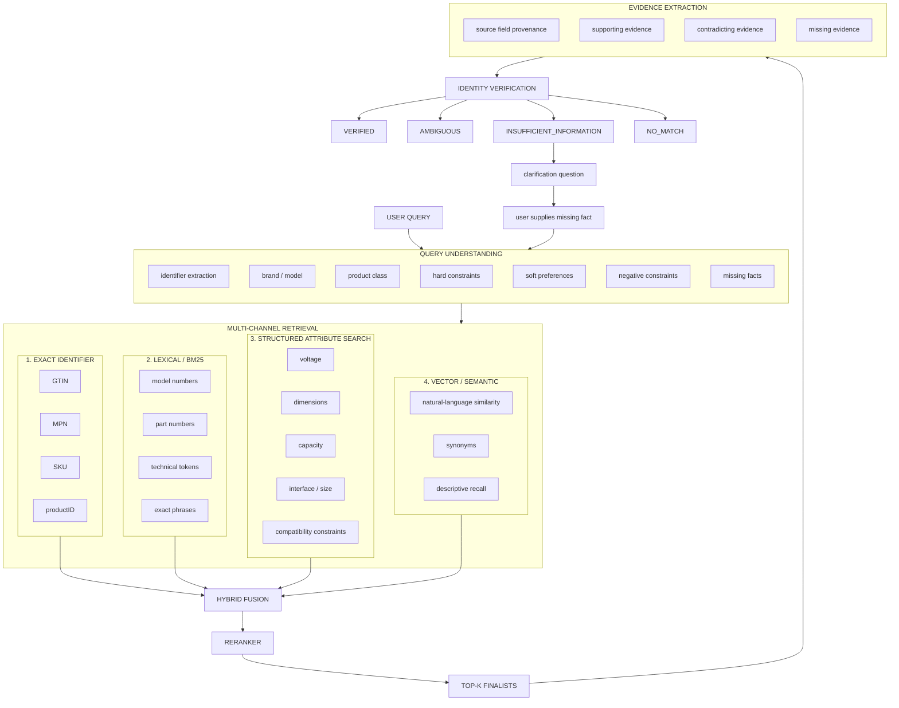

# Scenario Specification

**Scenario:** Verified Product Identification at Catalog Scale  
**Slug:** `verified_product_identification`  
**Proof class:** SCENARIO  
**Status:** DESIGN / NOT YET ACCEPTED — design documentation complete; awaiting human Scenario Quality Gate; implementation not initialized.

[← Back to public Scenario page](README.md)

---

## A. SCENARIO

### Real problem

Large distributors, manufacturers, parts catalogs, and ecommerce operators maintain catalogs with **millions of product offers**. Offers arrive from heterogeneous retailers with inconsistent structure: GTINs, MPNs, retailer SKUs, key-value attributes, HTML spec tables, partial descriptions, and noisy metadata.

Users — technicians, buyers, support agents, procurement staff — describe products imperfectly:

- natural-language descriptions without identifiers;
- partial or mistyped model/part numbers;
- compatibility requirements ("same voltage as…", "fits 2019 F-150 crew cab");
- mixed constraints (brand + capacity + interface + form factor);
- fragments of identifiers (GTIN missing check digit, truncated MPN).

The catalog contains **near-identical variants** that differ by parameters that matter operationally: voltage, interface, ECC vs non-ECC, capacity tier, regional SKU, generation suffix.

The business task is **verified product identification**: determine whether a specific product identity is supported by catalog evidence — or honestly refuse when evidence is insufficient, contradictory, or ambiguous.

This is **not** semantic search over 3.77M records. It is **not** RAG over a product database. It is identity establishment under ambiguity at catalog scale.

### Who has the problem

- **Parts and procurement teams** sourcing replacement components from large heterogeneous catalogs.
- **Technical support and field service** identifying correct variants from customer descriptions.
- **Ecommerce catalog operators** matching user intent to the correct offer/SKU among millions of near-duplicates.
- **AI platform owners** who must prove identification systems do not equate retrieval ranking with verified identity.

### Why it matters

Selecting the wrong variant has direct operational consequences. Unlike a low-stakes search suggestion, a wrong identity decision can propagate into physical fulfillment, installation, and service workflows. Systems that sound confident while returning the top semantic match create false operational certainty.

### Failure consequences

- wrong replacement component shipped (incompatible voltage, interface, size, or capacity);
- incorrect RAM/storage/network part in a configured system;
- wrong automotive or industrial component installed;
- return/RMA and reverse logistics cost;
- technician or line downtime while correct part is re-identified;
- incorrect bulk procurement;
- wasted time across support, warehouse, and field teams;
- erosion of trust in AI-assisted catalog tools that "always find something."

### Why it is difficult

The canonical catalog is real and adversarial by nature:

**Scale and heterogeneity**

- 3,770,377 selected offers from WDC V2 non-normalized corpus;
- 2,753,163 unique `cluster_id` values; 399,868 multi-offer clusters containing 1,417,082 offers;
- 24,641,565 raw attribute entries across 337,163 unique attribute names;
- 1,129,415 offers with some GTIN; 714,082 with multiple identifier types.

**Missingness and noise**

- 2,242,958 offers without brand; 1,547,289 without category; 1,363,772 without description;
- multilingual content, encoding damage, retailer-local identifiers;
- `specTableContent` present on all selected records but often contains store boilerplate, shipping tables, or size charts rather than true product specs;
- `keyValuePairs` and `specTableContent` sometimes conflict or differ in scope.

**Identity ambiguity**

- near-identical variants differing by critical parameters;
- semantic descriptions that match multiple products;
- identifier collisions and retailer-local SKU semantics;
- incorrect or overly broad categories.

**Evaluation difficulty**

- `cluster_id` is useful reference signal from WDC, not infallible ground truth;
- full-catalog search at 3.77M scale is required for credible proof — tiny fixtures alone are insufficient.

### Naive / simple failure mode

**Vector search + LLM picker:**

```text
embed 3.77M offers
→ retrieve top-10 by cosine similarity
→ rerank (optional)
→ LLM: "pick the best match"
→ return top candidate as product identity
→ PASS (wrong)
```

This fails because:

- semantic similarity ≠ material identity;
- reranker score ≠ verification;
- the model may confidently pick a near-identical incompatible variant;
- missing distinguishing constraints are not surfaced;
- contradictory hard specs can be ignored in fluent prose;
- local-SKU collisions look plausible;
- abstention is not a first-class outcome.

**Exact identifier lookup only:**

```text
extract identifier from query
→ exact match in catalog
→ return match
→ PASS (wrong when identifier partial, wrong, or absent)
```

This fails because realistic requests omit identifiers, contain typos, use natural language, or require distinguishing variants within the same product family.

**Harness theater:**

```text
proof benchmark injects correct candidate into top-1
→ verifier always passes
→ PASS (wrong)
```

### WOW factor

WOW is **not** embedding 3.77M products, hybrid search plumbing, or agent count.

WOW is the visible separation:

```text
USER REQUEST — incomplete / imprecise product description
↓
CATALOG — 3.77M noisy offers; several convincing candidates
↓
MULTI-CHANNEL RETRIEVAL — recall-oriented candidate generation
↓
RERANKING — better ordering, still not identity proof
↓
EVIDENCE VERIFICATION — material constraints checked against source fields
↓
VERIFIED — only when evidence supports identity
   or
BOUNDED REFUSAL — AMBIGUOUS / INSUFFICIENT_INFORMATION / NO_MATCH
```

A skeptical reviewer should see: **the top-ranked candidate is not automatically the verified product**, and the system can refuse rather than fabricate certainty.

### Skeptic Challenge

> "Why isn't this just: embed 3.77M products, retrieve top-10, rerank, ask GPT to choose one?"

**Design response:**

| Skeptic claim | Design counter |
| --- | --- |
| "Vector search finds the product" | Vector recall finds *candidates*; similarity score is not identity evidence. Near variants can score higher than the correct product on one channel. |
| "Reranking fixes it" | Reranking improves ordering; it does not verify material constraints. A reranker can promote a semantically polished incompatible variant. |
| "The LLM will pick correctly" | Models confidently select plausible but wrong variants when hard specs conflict or distinguishing facts are missing. |
| "Just use exact identifier lookup" | Many real requests lack reliable identifiers; partial codes and retailer SKUs collide; variants share family names. |
| "3.77M scale is the hard part" | Scale is necessary but not sufficient. The hard part is **verified identity under ambiguity** at scale. |
| "Cluster ID gives you ground truth" | WDC clusters are reference signal for benchmark construction, not infallible oracle labels for every identity decision. |

The proof must demonstrate that **retrieval quality** and **verification safety** are separate measured obligations.

> "Why not just exact identifier lookup?"

Because the scenario includes cases where users provide natural language only, partial identifiers, typos, model names mixed with compatibility constraints, and close variants that share identifiers or family names. Identifier channels are first-class — but not sufficient alone.

### Adversarial conditions

Future benchmark case classes (design — fixtures not yet created):

| # | Case class | What it tests |
| --- | --- | --- |
| 1 | Exact identifier match | GTIN/MPN/SKU channel recalls correct offer; verification confirms |
| 2 | Partial identifier | Truncated or incomplete code still routes to candidate set |
| 3 | Typo / malformed product code | Lexical/normalized retrieval tolerates edit distance without false verification |
| 4 | Natural-language description only | Semantic recall without identifier; verification uses attributes |
| 5 | Close product variant | Near-identical titles; hard spec distinguishes (ECC vs non-ECC, SATA vs NVMe) |
| 6 | Correct product not rank-1 on one channel | Fusion/recall must surface true candidate before verification |
| 7 | Semantic near-match with conflicting hard spec | High similarity; verification rejects |
| 8 | Missing critical distinguishing constraint | `INSUFFICIENT_INFORMATION` — user or catalog lacks distinguishing fact |
| 9 | Two indistinguishable candidates | `AMBIGUOUS` abstention |
| 10 | Incorrect/missing category | Retrieval must not rely solely on category metadata |
| 11 | Missing brand | Identification from specs/description/identifiers |
| 12 | Noisy `specTableContent` / boilerplate | Evidence extraction ignores boilerplate; uses source fields |
| 13 | Multilingual query vs catalog content | Recall across language mismatch where feasible |
| 14 | Identifier conflict | Typed identifiers disagree; verification does not silently override |
| 15 | No valid product exists | `NO_MATCH` — not retrieval failure |

### Scenario Quality Gate

This scenario is a **candidate** for human Scenario Quality Gate because:

- real enterprise pain exists (wrong part identity at scale);
- failure has meaningful operational cost;
- the problem was not invented to demo a single platform feature;
- naive vector search + LLM picker is a credible false solution;
- ambiguity, missing evidence, near-duplicates, and identifier noise are intrinsic;
- outcomes are evaluable with explicit PASS/FAIL semantics;
- the story is understandable without Intergrax internals;
- WOW comes from verified identity vs retrieval ranking, not infrastructure theater;
- a skeptical engineer can challenge the design before any code exists;
- a real 3.77M-offer dataset foundation is validated with measured statistics.

**Gate decision:** NOT YET PERFORMED — awaiting independent human review.

### Application Survival Test

> If proof infrastructure, evaluator, evidence packaging, and report generation are removed, does a useful autonomous application component remain that still solves the underlying problem?

Required answer: **YES**.

The production application must still:

- accept user product-identification requests;
- query the full catalog through the retrieval stack;
- verify identity against catalog evidence;
- return `VERIFIED`, `AMBIGUOUS`, `INSUFFICIENT_INFORMATION`, or `NO_MATCH`;
- surface clarification needs when distinguishing facts are missing.

If removing proof infrastructure removes verification or catalog search, redesign is required.

### Application Observability Test

> If the proof evaluator, evidence packaging, and HTML report are removed, does the application/runtime still produce enough structured execution information to reconstruct its material decisions, actions, observations, challenges, recoveries, diagnostics, and terminal result?

Required answer: **YES**.

Proof must consume production-path structured observations. Proof must not reconstruct fictional model reasoning post hoc.

### Observability / Explainability / Diagnostics Contract

**Material decisions:** (application-owned, must be observable):

1. Parsed query constraints (identifiers, brand, model, hard/soft constraints, negatives, missing facts).
2. Retrieval channel invocation and per-channel candidate counts.
3. Fusion strategy outcome (which candidates entered the merged pool).
4. Reranker ordering of finalists.
5. Evidence extraction per finalist (which source fields support/contradict constraints).
6. Verification verdict per finalist and terminal outcome selection.
7. Abstention/clarification reason when not `VERIFIED`.

**Observability coverage** — production-path trace must expose at minimum:

| Stage | Observable fields |
| --- | --- |
| Query understanding | extracted identifiers (typed), brand, model/series, product class, hard constraints, soft preferences, negative constraints, missing distinguishing facts |
| Identifier extraction | raw token, normalized form, identifier type, confidence/source span |
| Retrieval | channels invoked (`exact`, `lexical`, `structured`, `vector`), query per channel, candidate count per channel, top candidate IDs per channel |
| Fusion | merged candidate pool size, channel contribution per candidate |
| Reranking | pre/post rank positions for finalists, reranker model/score (bounded) |
| Top-K selection | finalist offer IDs entering verification |
| Evidence extraction | source field provenance (`record_json` path), supporting constraints, contradicting constraints, missing constraints |
| Verification | per-finalist status, aggregate terminal outcome, abstention reason |
| Timings | per-stage latency (bounded aggregates acceptable) |
| Failures | retrieval errors, empty channels, verification errors with structured diagnostics |

**Explainability:** Each verification decision must cite **catalog evidence references** (offer ID + source field path + extracted value). Confidence scores alone cannot override explicit contradiction.

**Evidence linkage:** Evidence items reference immutable source `record_json` fields — not derived-only search text without provenance.

**Action correlation:** Tool/search invocations link to retrieval channel traces.

**Diagnostics:** Structured failure states for empty retrieval, verification timeout, identifier parse failure, database unavailable.

**Redaction:** PII in raw descriptions if present in source records; full 3.77M embeddings or bulk record dumps are **not** required in traces.

**Operator visibility:** Terminal outcome, finalist offer IDs, constraint support/contradiction summary, abstention reason.

**Proof consumption:** Proof report projects from canonical structured trace artifacts. Proof evaluator compares terminal outcome and evidence citations against hidden benchmark expectations — it does not re-run verification.

**Machine-readable artifact:** Expected projection includes query constraints, channel metrics, finalist evidence graph, terminal outcome — design-stage; exact schema deferred to implementation.

**Application Observability Test result:** **YES** (by design — required before implementation acceptance).

### Conditional authoring prompts

**Hidden truth / evaluator leakage:** Benchmark cases carry hidden expected outcome and expected identity (offer ID and/or cluster reference). Hidden expectations are available to the **proof evaluator only** — never to the application runtime, query prompts, retrieval indexes exposed to the model, or verification prompts. Proof must **never** inject the correct product into the candidate set.

**Evidence boundary:** Legitimately observable evidence is whatever the application retrieves from the canonical catalog through declared channels — `record_json` source fields, derived search indexes with provenance back to source, and parsed query constraints from the user request. Evaluator ground truth is not runtime evidence.

**Alternative hypotheses / failure alternatives:** For each case, plausible wrong candidates must remain in the search space — semantically similar variants, identifier collisions, category neighbors. The system must distinguish verified identity from plausible alternatives using material constraints.

**Independence:** Verification evaluates candidates against extracted constraints and source evidence. It does not receive hidden benchmark labels, expected offer IDs, or proof-evaluator verdicts during execution.

**Temporal semantics:** **Not material** for this scenario. Catalog snapshots are quasi-static for a proof run. Price freshness and offer availability are out of scope unless explicitly added in a future revision.

**Side effects / recovery / HITL / governance:** No mutating side effects in scope. Clarification questions to the user are an application behavior (`INSUFFICIENT_INFORMATION`), not proof-harness behavior. Governance relevant only insofar as the application must not fabricate catalog evidence.

---

## B. SOLUTION

### APPLICATION vs PROOF HARNESS

| APPLICATION / PRODUCTION PATH OWNS | PROOF OWNS |
| --- | --- |
| Query understanding (identifiers, constraints, missing facts) | Benchmark case definitions |
| Multi-channel candidate generation (exact, lexical, structured, vector) | Hidden expected identity / expected outcome |
| Hybrid fusion and reranking | Adversarial case selection and stratification |
| Evidence extraction from source `record_json` | Evaluator (outcome + evidence checks) |
| Identity / constraint verification | Metric aggregation (recall, MRR, FP rate, abstention correctness) |
| Terminal outcome decision (`VERIFIED`, `AMBIGUOUS`, `INSUFFICIENT_INFORMATION`, `NO_MATCH`) | PASS/FAIL verdict |
| Clarification requirement surfacing | Evidence projection for report |
| runtime execution trace / diagnostics (bounded) | Reproduction metadata |
| Source provenance back to catalog fields | Baseline comparison harness configuration |
| Database/search infrastructure for full catalog | Gold-set curation pipeline (future) |
| Derived search indexes (with provenance) | Leakage guards and fixture isolation tests |

**PROOF DOES NOT OWN:** fabricated rationale; reconstructed model intent not present in runtime artifacts; post-hoc explanation generated by another LLM; inserting correct candidates into retrieval results; running the verifier on behalf of the application.

### Desired behavior

The identification system behaves like a disciplined catalog engineer:

1. **Parse** the user request into typed identifiers, brand/model hints, hard constraints, soft preferences, negative constraints, and missing distinguishing facts.
2. **Generate candidates** through independent retrieval channels optimized for recall.
3. **Fuse and rerank** to improve ordering — without treating rank as identity.
4. **Extract evidence** from immutable source catalog fields for each finalist.
5. **Verify** material identity constraints — supporting, contradicting, and missing evidence explicit.
6. Return **`VERIFIED`** only when constraints are supported and no disqualifying contradiction remains.
7. Return **`AMBIGUOUS`** when multiple candidates remain materially indistinguishable.
8. Return **`INSUFFICIENT_INFORMATION`** when required distinguishing facts are missing.
9. Return **`NO_MATCH`** when candidates are sufficiently rejected and no verified product remains.
10. Emit **bounded structured trace** sufficient for proof projection without proof-only logging.

### Step-by-step story

#### VERIFIED path (intended success story)

```text
USER — "Samsung 990 PRO 2TB M.2 2280 NVMe PCIe 4.0"
↓
QUERY UNDERSTANDING — brand=Samsung; model family=990 PRO; capacity=2TB (hard);
  form=M.2 2280 (hard); interface=NVMe PCIe 4.0 (hard/likely); no GTIN provided
↓
CANDIDATE GENERATION
  exact: no GTIN in query → channel skipped or low yield
  lexical: "990 PRO" + "2TB" → recall set includes Samsung SSD variants
  structured: capacity=2TB, form factor candidates
  vector: semantic recall from natural-language query
↓
FUSION — merged pool includes correct 2TB 990 PRO and near variants (1TB, SATA, etc.)
↓
RERANKER — promotes likely Samsung 990 PRO variants; rank-1 may still be wrong variant
↓
EVIDENCE EXTRACTION — for top finalists, read source KVP/spec fields with provenance
↓
VERIFICATION
  finalist A (990 PRO 2TB NVMe): capacity ✓ interface ✓ form ✓ brand ✓ → supports
  finalist B (990 PRO 1TB NVMe): capacity ✗ → contradicts
  finalist C (870 EVO 2TB SATA): interface ✗ → contradicts
↓
VERIFIED — finalist A; evidence trail cites source fields
↓
RESOLVED envelope
```

#### AMBIGUOUS path

```text
USER — partial description matches two offers with identical material specs in catalog
↓
retrieval surfaces both finalists with equivalent supporting evidence
↓
verification cannot find material distinguishing constraint
↓
AMBIGUOUS — abstain; do not force top-1
↓
UNRESOLVED envelope
```

#### INSUFFICIENT_INFORMATION path

```text
USER — "Lenze motor for line 4" (voltage/coupling not specified)
↓
retrieval surfaces multiple Lenze motors with different voltage ratings
↓
verification: missing critical distinguishing constraint in query and not inferable from catalog alone
↓
INSUFFICIENT_INFORMATION — surface what fact is needed (e.g., voltage, mounting, part number)
↓
UNRESOLVED envelope
```

#### NO_MATCH path

```text
USER — "ABC-9999 widget 48V" (product does not exist in catalog)
↓
retrieval may surface near matches (ABC-9998, 24V variant)
↓
verification: identifier and voltage constraints contradict all finalists
↓
NO_MATCH — conclusive rejection; no fabricated product
↓
RESOLVED envelope
```

### Ideal architecture

Design from first principles — not constrained by current Intergrax implementation.



**Layer roles:**

- **Exact retrieval** — for strong typed identifiers (GTIN, MPN, SKU, productID).
- **BM25 / lexical** — for model numbers, part numbers, and exact technical tokens.
- **Structured retrieval** — for hard constraints such as voltage, capacity, dimensions, and interface.
- **Vector retrieval** — for natural-language and semantic recall.
- **Hybrid fusion** — merges independent candidate-generation signals without treating any single channel as identity proof.
- **Reranker** — improves ordering; it does **not** verify identity.
- **Evidence extraction** — binds each finalist to source-truth catalog fields with provenance.
- **Verification** — decides whether identity is actually supported by evidence.

**TOP-RANKED CANDIDATE IS NOT A VERIFIED PRODUCT.**

**Reference infrastructure hypothesis:** PostgreSQL + pgvector as the operational database for relational data, lexical/full-text search, structured filters, and vector search in one deployable unit (Docker-friendly). This is the **preferred design hypothesis** — not a proven final choice. Alternative dedicated search engines are not required unless benchmark calibration shows a material gap.

Trade-offs documented:

| Approach | Benefit | Cost / risk |
| --- | --- | --- |
| PostgreSQL + pgvector | Single ops surface; structured + lexical + vector co-location | Index tuning at 3.77M scale; attribute heterogeneity |
| Separate vector DB (e.g., Qdrant) | Specialized ANN | Second system; provenance/join complexity — not justified without measured need |
| Elasticsearch/OpenSearch | Strong lexical | Additional infrastructure — not justified without measured lexical gap |

### Data preparation model

Two representations coexist:

**Immutable source truth (verification authority)**

- raw `record_json` per offer
- original identifiers, title, description, category, brand
- original `keyValuePairs`, `specTableContent`, `cluster_id`
- never silently overwritten by derived cleaning

**Derived search representation (recall authority)**

- normalized identifier forms (zero-stripped GTIN, case-folded MPN)
- lexical index text (title, description, model tokens)
- structured/search fields for high-value attributes (capacity, voltage, interface — normalized subset, not all 337k raw names as columns)
- embedding vectors for semantic recall
- optional cluster_id for benchmark stratification

**Critical rule:** derived data may improve search, but verification must cite **source fields** with provenance. If derived normalization conflicts with source, source wins for verification unless explicit transformation rules are logged.

Preprocessing is deterministic, reproducible, and versioned. Not implemented in this design task.

### Candidate generation

Independent channels with distinct failure modes:

**A. Exact identifier retrieval** — GTIN / MPN / SKU / productID as typed lookups, not embedding text. Retailer-local SKU/productID are weak global identity signals — typed, not automatically authoritative across retailers.

**B. Lexical retrieval** — model numbers, part numbers, fragmented names, technical tokens, exact phrases.

**C. Structured attribute retrieval** — hard requirements on normalized fields (voltage, dimensions, capacity, interface, size). Not all 337k raw attribute names become relational columns; normalization targets high-value constraint families.

**D. Dense vector retrieval** — semantic/natural-language recall. Vector score is **never** sufficient evidence of identity.

### Fusion

Combine independent channel results into a recall-oriented candidate pool. Exact algorithm not frozen — must preserve channel attribution per candidate for observability. Goal: if the correct offer is findable by any channel, it enters the pool before reranking.

### Reranking

Cross-encoder or LLM reranker improves finalist ordering. Reranker score is **not** verification. A high reranker score with contradicting hard specs must still fail verification.

### Verification

Answers: **"Do we have enough evidence to assert this candidate is the product?"**

For each finalist, compare material constraints from query understanding against evidence extracted from source catalog fields.

| Evidence class | Treatment |
| --- | --- |
| Supporting | Constraint satisfied by source field with provenance |
| Contradicting | Source field conflicts with hard constraint — disqualifies finalist |
| Missing | Required constraint cannot be confirmed or denied from available evidence |

**Examples of contradiction (must NOT verify):**

- requested 32GB ECC RDIMM → candidate 32GB non-ECC UDIMM
- requested M.2 NVMe → candidate M.2 SATA
- requested part ABC-123 → candidate ABC-123A with different GTIN
- requested 48V → candidate 24V in source KVP

Confidence alone cannot override contradiction.

### Outcomes

| Outcome | Semantics | Envelope |
| --- | --- | --- |
| **VERIFIED** | Material identity constraints supported; no disqualifying contradiction | RESOLVED |
| **NO_MATCH** | Sufficient evidence to reject finalists; no verified candidate remains. **Not** retrieval failure. | RESOLVED |
| **AMBIGUOUS** | ≥2 finalists materially indistinguishable with available evidence | UNRESOLVED |
| **INSUFFICIENT_INFORMATION** | Required distinguishing facts missing from request or catalog | UNRESOLVED |

### Guarantees

Candidate system-level guarantees (design stage — not yet demonstrated):

- Retrieval and verification are **separate stages** with separate metrics.
- Exact identifiers are a **first-class typed channel**.
- Vector and reranker scores **cannot** single-handedly produce `VERIFIED`.
- Verification cites **source provenance** (`record_json` field paths).
- Contradictions **disqualify** finalists regardless of similarity score.
- Abstention outcomes are **first-class** (`AMBIGUOUS`, `INSUFFICIENT_INFORMATION`).
- `NO_MATCH` is a conclusive identity judgment, not "nothing found in top-k."
- Full canonical evaluation runs against the **3.77M-offer search corpus**.
- Proof never injects correct candidates or runs verification on behalf of the application.

### Claim

Candidate bounded falsifiable claim (design — **not** a proven public claim):

> **Given the declared canonical multi-million-offer catalog and adversarial product-identification cases, the system can generate candidate products through independent retrieval channels and accept an identification only when material identity constraints are supported by traceable catalog evidence; when decisive evidence is contradictory or insufficient, it returns a bounded non-verified outcome instead of presenting the highest-ranked candidate as fact.**

Avoid: "always," "all products," "zero hallucinations," "perfect compatibility," "universal product matching."

### PASS

Candidate PASS semantics — thresholds **TO BE FROZEN DURING PROOF DESIGN / BENCHMARK CALIBRATION**:

**Retrieval quality**

- Correct product/offer survives candidate generation for required case classes (recall@K).
- Independent retrieval channels are observable in trace.
- Correct product not ranked #1 on one channel still enters pool when another channel recalls it.

**Verification safety**

- Hard negative with high semantic similarity is **rejected** by verification.
- Identifier contradictions are not silently overridden.
- Verifier cites source evidence used (field provenance).
- `AMBIGUOUS` case abstains — no forced single product.
- `INSUFFICIENT_INFORMATION` surfaces missing distinguishing fact.
- `NO_MATCH` does not fabricate a product.

**Proof integrity**

- Canonical evaluation operates against full 3.77M-offer search corpus.
- Target architecture measured against simpler baseline(s) — improvement is numeric, not narrated.
- Hidden benchmark labels do not leak into runtime.
- Proof harness does not inject correct candidate or run application verification.

### FAIL

Explicit FAIL if any of the following occurs:

- PASS based only on model prose without structured evidence.
- Top-1 retrieval automatically accepted as `VERIFIED`.
- Vector or reranker score used as identity proof.
- Evaluation silently uses tiny fixture corpus instead of full catalog without explicit bounded scope declaration.
- Hidden ground truth leaks into application runtime context.
- Benchmark manually injects correct candidate into retrieval results.
- Missing candidate replaced by fabricated product.
- Contradicting hard spec ignored because of high similarity.
- `AMBIGUOUS` case forced to single product.
- `NO_MATCH` returned when a verified candidate exists, or `VERIFIED` when contradiction exists.
- Proof harness performs business verification instead of application.
- Baseline comparison omitted or narrated without measurement.

### Baseline / ablation plan

Future benchmark must prove architectural complexity earns its keep:

| Variant | Description |
| --- | --- |
| **BASELINE A** | Lexical/exact search only |
| **BASELINE B** | Dense vector search only |
| **BASELINE C** | Hybrid retrieval without reranker or verification (top-1/top-k acceptance) |
| **TARGET** | Hybrid candidate generation + reranking + verification |

Metrics (thresholds TO BE FROZEN during benchmark calibration):

- Recall@K / candidate recall per case class
- Ranking quality (MRR, NDCG@K where appropriate)
- Top-1 identity accuracy (verification-adjusted, not raw retrieval)
- False-positive identification rate
- Abstention correctness (`AMBIGUOUS`, `INSUFFICIENT_INFORMATION`)
- Hard-negative rejection rate
- Latency per stage (p50/p95)
- Resource/cost characteristics (optional, bounded reporting)

### Adversarial attacks

See § Adversarial conditions (15 case classes). Proof stratifies cases across identifier reliability, variant proximity, missingness, noise, and multilingual content where feasible.

### Excluded claims

- Universal compatibility checking across arbitrary systems or configurations.
- Perfect attribute normalization across all 337k raw attribute names.
- Infallible `cluster_id` as oracle ground truth.
- Zero false positives at production scale without stated thresholds.
- Proof that any single retrieval channel alone solves the scenario.
- Claim that PostgreSQL/pgvector is the only viable infrastructure.
- Real-time price accuracy or offer availability guarantees.
- Multilingual perfection across all catalog languages.

### Limitations

- Single bounded domain: **product identification from catalog evidence** at measured WDC scale.
- Dataset distribution / public artifact hosting **not finalized** (`DATASET_DISTRIBUTION = OPEN`).
- `cluster_id` useful for benchmark construction — requires quality filters and human/deterministic validation for hard gold sets.
- Implementation not initialized; no executable proof or verified run.
- Benchmark thresholds not yet calibrated on gold set.
- Attribute normalization scope deliberately bounded — not all raw KVP names modeled relationally.

### Dataset provenance / reproducibility

| Item | Value |
| --- | --- |
| Source | Web Data Commons Large Scale Product Corpus V2 — `offers_corpus_all_v2_non_norm` |
| Original source size | 26,507,210 offers |
| Selection rule | `keyValuePairs != null` OR `specTableContent != null` |
| Canonical count | 3,770,377 product offers |
| Canonical artifact | `selected_offers.parquet` (~1.71 GiB, ZSTD, `record_json` column) |
| Builder | `dataset/build_wdc_dataset.py` — deterministic, streaming, lossless at JSON-value semantic level |
| Profiler | `dataset/profile_selected_dataset.py` — measured statistics on full canonical set |

**DATASET_DISTRIBUTION = OPEN / MUST RESOLVE BEFORE PUBLIC REPRODUCTION.**

Candidate mechanisms: dedicated proof-assets repository + release artifacts; GitHub Release asset; external immutable artifact storage with checksum verification in proof runner. Not chosen in this task.

Preferred future reviewer experience:

```text
clone repo
→ start/run scenario
→ canonical dataset automatically resolved/downloaded
→ checksum verified
→ database initialized
→ proof ready
```

---

## C. INTERGRAX FIT

NOT YET PERFORMED

INTERGRAX FIT is not a single-domain assignment. Expected future analysis:

```text
APPLICATION NEED
→ PLATFORM MECHANISM
→ CURRENT PLATFORM OWNER
→ STATUS
```

Also audit **TEST-ONLY SUBSTITUTE PRESENT?** in canonical Scenario path — **YES** is a **BLOCKER**.

Do not prepopulate participating domain(s) — domains are discovered during capability-fit.

## D. GAP DECISION

NOT YET PERFORMED

## E. PROOF BUILD

NOT STARTED — blocked on scenario acceptance, APPLICATION vs PROOF HARNESS separation, and:

- human Scenario Quality Gate
- Intergrax Fit
- Gap Decision
- implementation initialization
- dataset distribution resolution

Before implementation confirm: production-capable application exists; canonical path has no prohibited fake/test shortcuts; controlled providers use normal application contracts; real model boundary configured if AI behavior is material; full 3.77M catalog loaded in search infrastructure.
